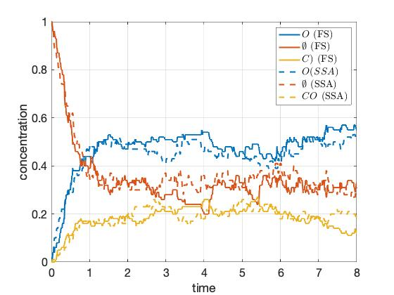
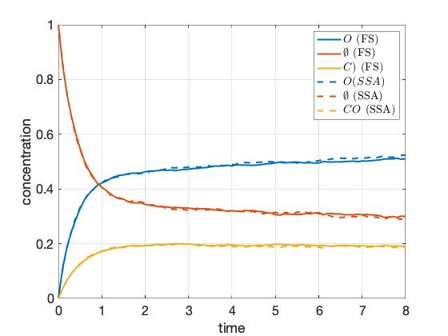

### Description

This code simulates the Fractional-Step (FS) algorithm described in [1] and [2] on the Ziff–Gulari–Barshad model. Although the algorithm is parallel, the code is not and it runs all blocks sequentially. It was used as a proof of concept.

This video is a simulation on a 200x200 lattice with 4x4 blocks.

The next figure is a comparison of the FS algorithm with the Gillespie (or SSA) algorithm on a 10x10 lattice with 2x2 blocks and dt=0.01. The constants in the ZGB model are k1=0.394 and k2=1.

The next figure is a comparison of the FS algorithm with the Gillespie (or SSA) algorithm on a 100x100 lattice with 4x4 block and dt=0.1. The constants in the ZGB model are k1=0.394 and k2=1.

[1] G. Arampatzis, M. A. Katsoulakis, P. Plecháč, M. Taufer, and L. Xu, “Hierarchical fractional-step approximations and parallel kinetic Monte Carlo algorithms,” Journal of Computational Physics, vol. 231, no. 23, pp. 7795–7814, Oct. 2012, doi: 10.1016/j.jcp.2012.07.017.

[2] G. Arampatzis and M. A. Katsoulakis, “Goal-oriented sensitivity analysis for lattice kinetic Monte Carlo simulations,” The Journal of Chemical Physics, vol. 140, no. 12, p. 124108, Mar. 2014, doi: 10.1063/1.4868649.

